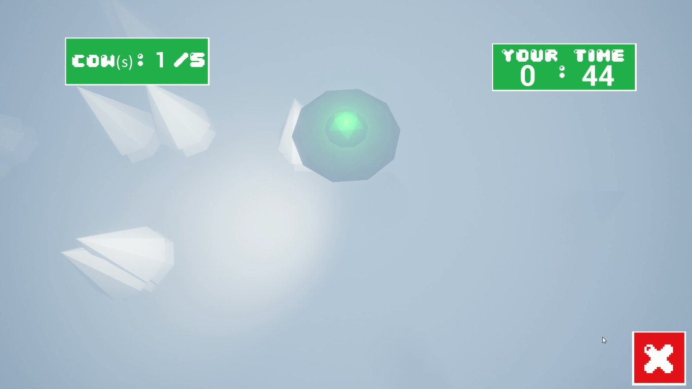
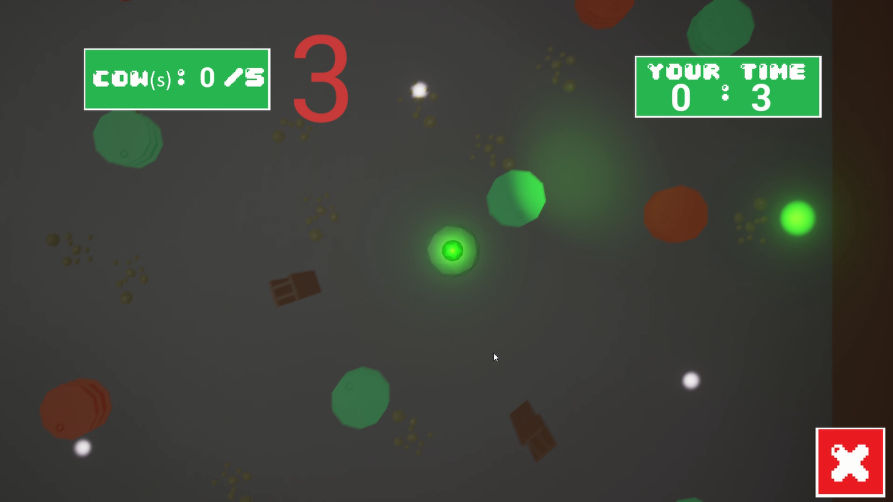
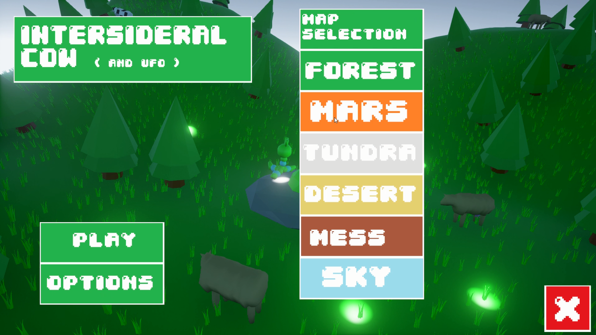
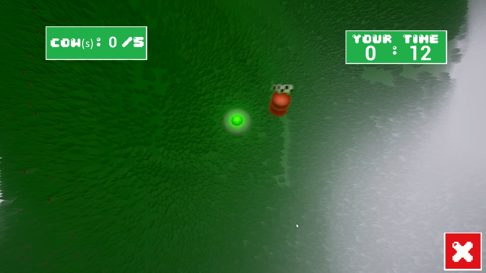

# Table of contents
- [Table of contents](#table-of-contents)
- [My timeline](#my-timeline)

# My timeline

- [2016](#2016)

## 2016
15 year old, just finishing middle-school. My first steps in the world of programming and game creation.
#### Games I made this year
- [Intersideral cow](#intersideral-cow)

## Intersideral Cow
[Unreal Engine 4](#unreal-engine-4) | [2016](#2016) | [Download](https://anicetngrt.itch.io/intersideral-cow)

My first released game!

I made this using Unreal Engine 4's "no code" blueprints system. Barely knew how to code back then. But I still got hooked by game development. Designing the gameplay, building an art direction, implementing, sound design and even marketing! 

I got my first experience at working on a project for days without being able to stop. It was truly amazing.

#### Gallery

